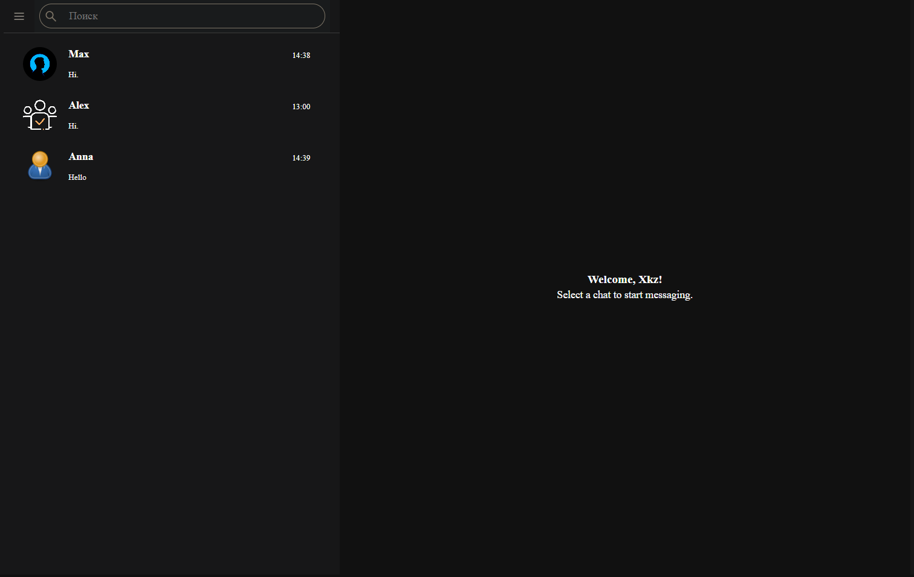
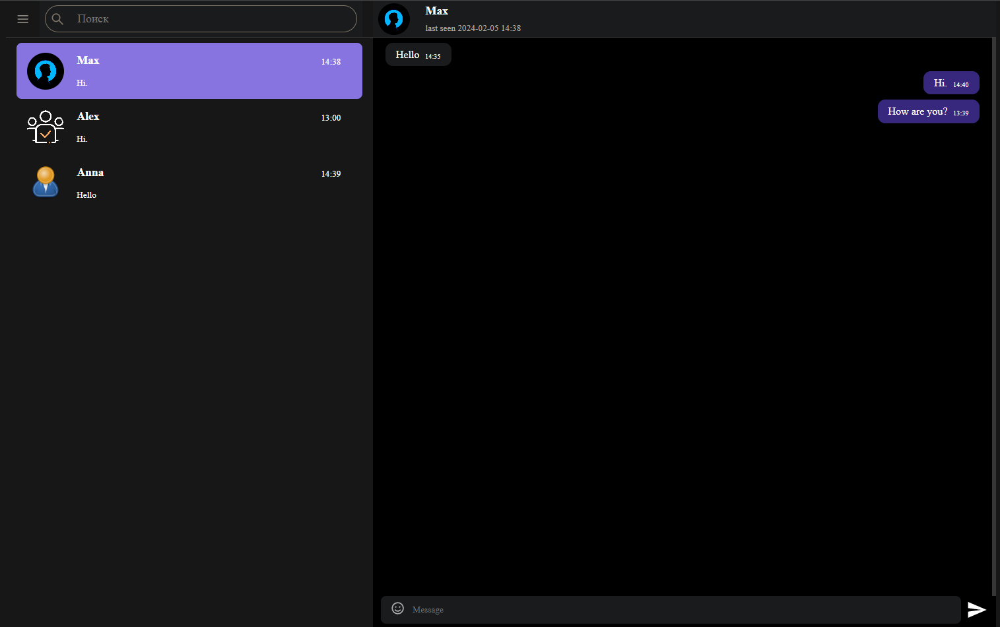
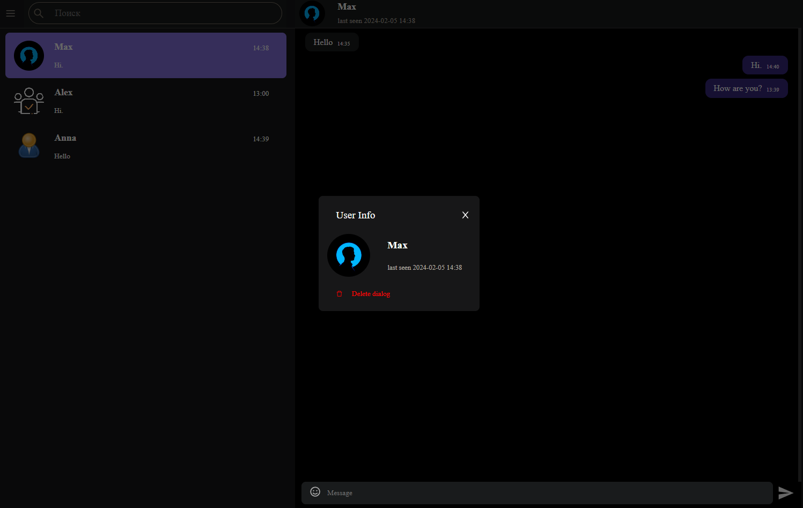
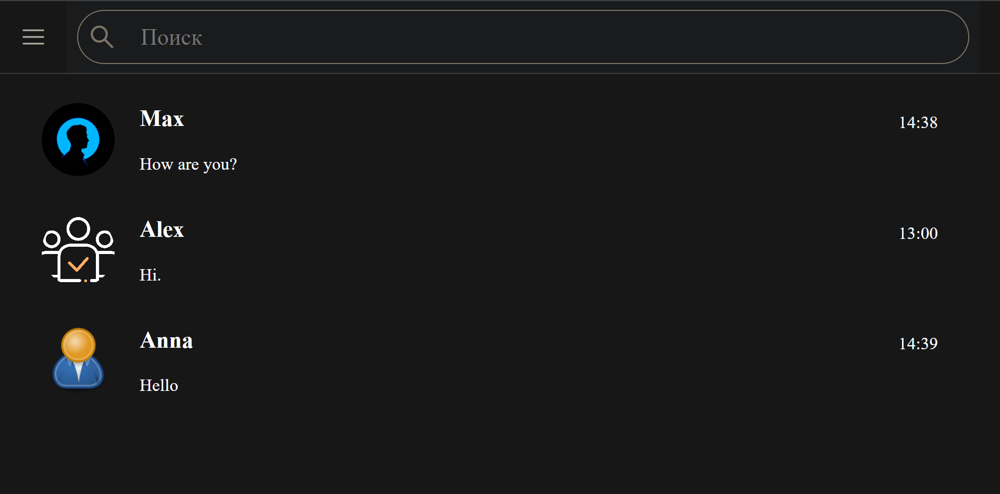
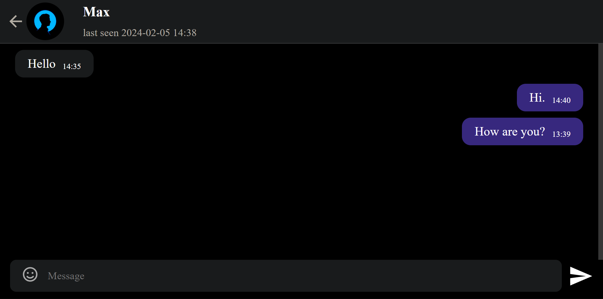

# Message (In developing)

Message is a mobile and desktop messaging web-app using PERN Stack.

#### Main page:



#### Message area page:



#### User cart page:



#### View from phone page:




## Installation Guide

### Requirements

- [Nodejs](https://nodejs.org/en/download)
- [PostgreSQL](https://www.postgresql.org/download/)

Both should be installed and make sure postgreSQL is running.

```shell
git clone https://github.com/xkz1899/message.git
cd message
```

Install the dependencies.

```shell
cd server
npm install
cd ../client
npm install
cd ..
```

#### Create a database named "message" in the database postgreSQL.

#### Start server.

```shell
cd server
npm start
```

#### Start client.

```shell
cd client
npm start
```

Now open http://localhost:3000 in your browser.
